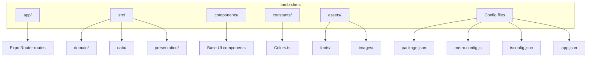
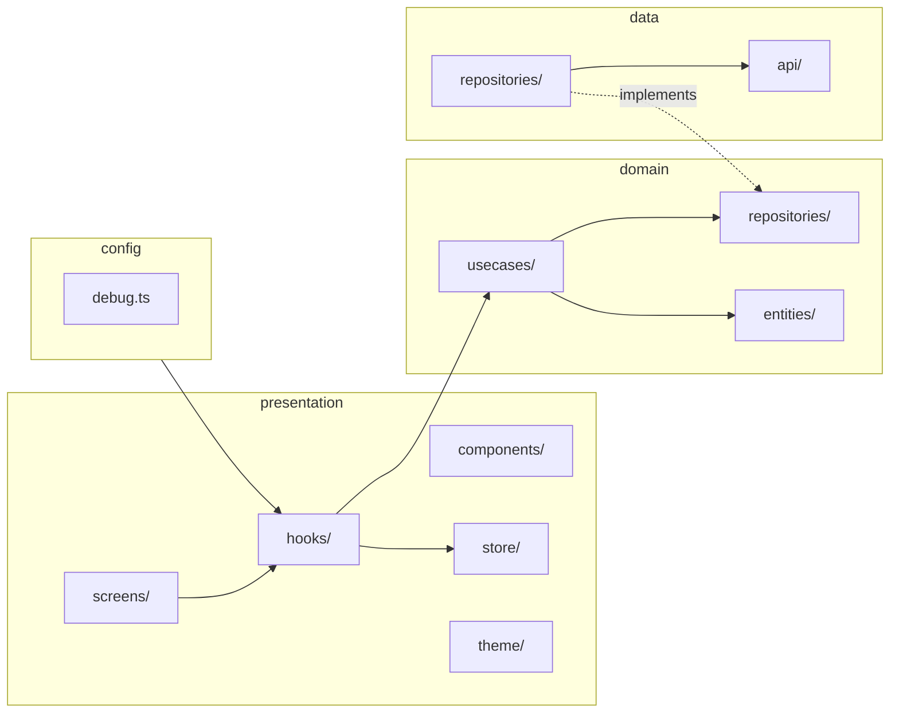
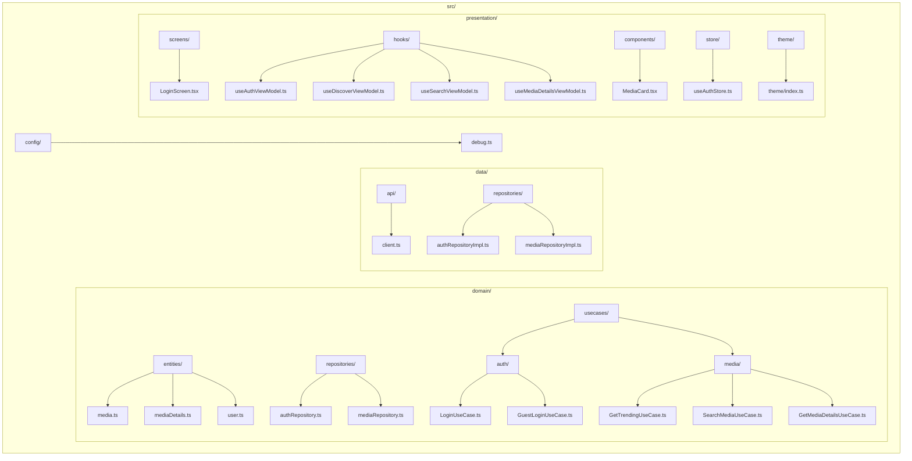
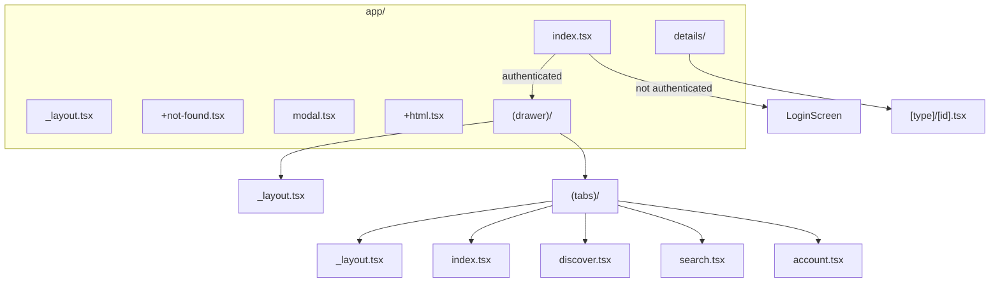

# TMDB React Native Client


A React Native app for browsing movies and TV shows using the [TMDB API](https://www.themoviedb.org/documentation/api). Built with Expo, TypeScript, Clean Architecture, and Zustand.

## Features

- **Authentication**: TMDB login and guest session.
- **Discovery**: Trending list, search, and genre exploration.
- **Details**: Deep dive into movies, shows, and people.
- **Dark mode**: First-class dark theme support.
- **Cross-platform**: Android, iOS, and Web (fast iteration in the browser).

## Requirements

- **Node.js** 18+ (20 LTS recommended)
- **npm** 9+
- **TMDB account** and [API Key](https://www.themoviedb.org/settings/api) for environment variables

## Tech Stack

| Area | Technology |
|------|-------------|
| Framework | React Native (Expo SDK 54) |
| Language | TypeScript 5.9 (strict) |
| State | Zustand 5 (persist with AsyncStorage) |
| Navigation | Expo Router 6 (file-based) |
| UI | React Native Paper 5 (Material Design 3) |
| Network | Axios |
| Validation | Zod 4 |
| Testing | Jest, React Native Testing Library |

## Setup

### 1. Clone and install

```bash
git clone <repo-url>
cd tmdb-client
npm install
```

### 2. Environment variables

Copy the example file and set your TMDB API key:

```bash
cp .env.example .env
```

Edit `.env` and set (required for real usage):

| Variable | Description |
|----------|-------------|
| `EXPO_PUBLIC_TMDB_API_KEY` | TMDB API Key ([get one here](https://www.themoviedb.org/settings/api)) |
| `EXPO_PUBLIC_TMDB_BASE_URL` | API base URL (default `https://api.themoviedb.org/3`) |
| `EXPO_PUBLIC_DEBUG` | Optional: `true`/`false` for debug logs (in `__DEV__` it is on by default) |

### 3. Run the app

```bash
npm start          # Metro + QR for Expo Go
npm run web        # Development in browser (Metro)
npm run android    # Open on Android emulator/device
npm run ios        # Open on iOS simulator/device
```

**Testing on a physical device**

- **Android**: Install [Expo Go](https://play.google.com/store/apps/details?id=host.exp.exponent), same Wi‑Fi as your machine, scan the terminal QR code.
- **iPhone**: Install [Expo Go](https://apps.apple.com/app/expo-go/id982107779), same Wi‑Fi, scan the QR with the Camera app.
- If the app can’t reach the dev server: `npx expo start --tunnel`.

## Project structure

### Overview (root)



### Layers (Clean Architecture in `src/`)



### Folder detail in `src/`



### Routes (Expo Router in `app/`)



## Architecture

The app follows **Clean Architecture**:

- **`src/domain`**: Entities, repository contracts, and use cases (pure business logic).
- **`src/data`**: HTTP client (Axios), repository implementations, and external sources.
- **`src/presentation`**: Screens, hooks (ViewModels), UI components, store (Zustand), and theme.
- **`src/config`**: Shared configuration (e.g. debug logging).

Navigation is **file-based** with Expo Router: `app/` defines routes and layouts (Stack, Drawer, Tabs). Dynamic routes live in `app/details/[type]/[id].tsx`.

## Technical notes

- **Expo SDK 54**, React 19, and React Native 0.81.
- **Metro**: `unstable_enablePackageExports = false` in `metro.config.js` to avoid the `import.meta` error on web with Zustand (see [expo#36384](https://github.com/expo/expo/issues/36384)).
- **Path alias**: `@/*` points to the project root (`tsconfig.json`).
- **Persistence**: Zustand with `persist` and AsyncStorage (auth); on web it uses AsyncStorage’s web backend.
- **Debug**: `src/config/debug.ts` and `EXPO_PUBLIC_DEBUG` to enable/disable logs; on web, login errors are also shown via `window.alert`.

## Testing

```bash
npm test
```

- Jest and React Native Testing Library.
- Unit tests under `src/domain/usecases/.../__tests__/` and `components/__tests__/`.
- Snapshot tests for components where used.

## CI

The pipeline (`.github/workflows/ci.yml`) on every push/PR to `main`:

- Checkout, Node 20, `npm ci`
- Lint and typecheck (can be set not to fail the build)
- `npm test`

## License and attribution

Private project. Use of the TMDB API is subject to [TMDB API terms of use](https://www.themoviedb.org/documentation/api/terms-of-use).
